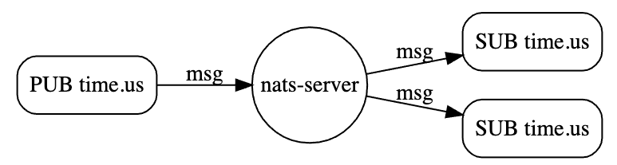

# NATS

方便码字，所以不再使用英文，而是简单使用中文。

NATS,直指官网：https://github.com/nats-io/nats.docs/blob/master/nats-concepts/intro.md

## What is NATS

- 2011年产生，NATS是分布式系统中，无论是software和hardware层面，提供对messaging支持的中间件。
- 提供了抽象层，介于application/service和物理网络层之间
- publisher加密发送数据，一个或者多个subscriber接收、解密、处理数据
- Clients通常通过一个url连接NATS系统，然后subscribe/publish消息到subjects，messaging-handling的代码很common,资源和相互依赖相互隔离，可以跨环境，跨语言，跨cloud providers或者on-premise system。
- NATS Core提供最多一次的质量保证。如果一个subscriber没有监听某个subject，或者没有匹配到任何一个subject，或者message发送的时候，subscriber没有被激活，那么该subscriber都不会被保证接收到消息。
- fire-and-forget messaging system，仅仅只会在内存中hold message，绝不会将消息写入到disk中，但是提供[NATS Streaming](https://docs.nats.io/nats-streaming-concepts/intro)或者在客户端中持久化消息。但是通过[Sequence Number](https://docs.nats.io/nats-concepts/seq_num)方式来保证消息一致性。

## Why NATS is needed

- 随着cloud technology兴起(Kubernetes, Cloud Foundry)的兴起，原先的分布式系统架构被扰乱了，很多老的系统的组件被分解，然后被分别部署到cloud上，作为cloud native application
- 庞大系统被肢解的组件到了cloud上之后，不同组件服务之间的交互，越来越多，而且量也越来越庞大,当前的一些技术手段已经无法满足越来越多的需求，比如：
    a. 怎样用一种技术应用多种messaging patterns
    b. 怎样解决Location Transparency的问题，有些时候必须知道当前系统到哪里去连接想要连接的目标系统
    c. Data producer和Data consumers之间的解藕问题
    d. built-in load balancing
- 基于上面的需求，以及下一代的cloud native application的需求，NATS应运而生

## NATS Components/Features

### Subject-Based Messaging

- NATS非常依赖于subjects，subjects分为streams和topics
- 可以把subject想象成一个字符串，publisher负责创建subject，subscriber通过subject找到publisher



- subject name不允许包含空格，由阿拉伯字母、点号组成
- subject name大小写敏感

#### Subject Hierarchies

"."被用于创建一个subject的继承关系,比如下面的subjects逻辑上都与time相关，通过"."将这些subjects组织了起来

```txt
time.us
time.us.east
time.us.east.atlanta
time.eu.east
time.eu.warsaw
```

#### Subject Wildcards

- NATS提供了两个通配符:`*`和`>`，这2个通配符可以代替点分隔主题中的一个或多个元素。
- Subscriber可以利用通配符，从一个subject中产生多个其他的通配符(事先双方约定好)，然后监听这些subject，相当于订阅一次，然后一个subject衍生出多个其他的subject
- Publisher通常不需要使用通配符来组织一个subject，一般只需要提供一个不包含通配符的全限定名的subject即可。所以特殊情况下，才需要提供通配符

##### Matching A Single Token

- 第一个通配符是*，通过*可以匹配到一个single token，比如通过`time.*.east`将会匹配到`time.us.east`和`time.eu.east`


##### Matching Multiple Tokens

- 第二个通配符`>`，可以匹配一个或者多个字符。但是只能往后匹配字符串末尾一级或者多级的字符，不能向前匹配，比如`time.us.>`可以往后匹配到`time.us.east`和`time.us.east.atlanna`。相比前者而言，`time.us.*`只能匹配`time.us.east`这样的字符，


##### Monitoring and Wire Taps

- NATS允许通过通配符创建wire tap来做一些security monitoring
- 最简单的方式：基于`>`创建一个subscriber，这样某个app就能接收到所有的message

##### Mix Wildcards

- 通配符`*`和`>`可以组合使用，比如`*.*.east.>`可以匹配到`time.us.east.atlanta`

## Publish-Subscribe

- One-to-Many,一个publisher发送到消息到某个subject上之后，任何订阅该subject的subscriber都将接收到消息
- Subscriber也可以监听wildcard subjects,通过正则方式(nats也支持你这样做)
