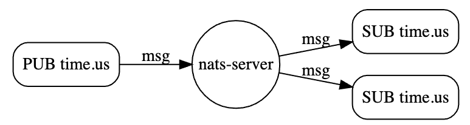
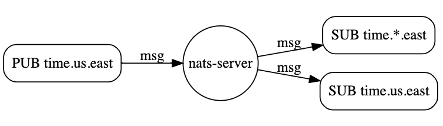
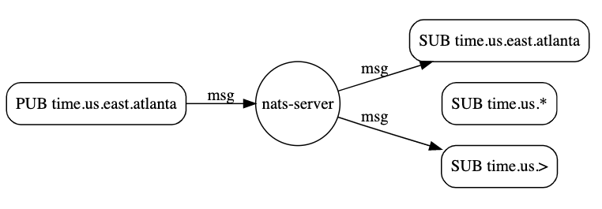
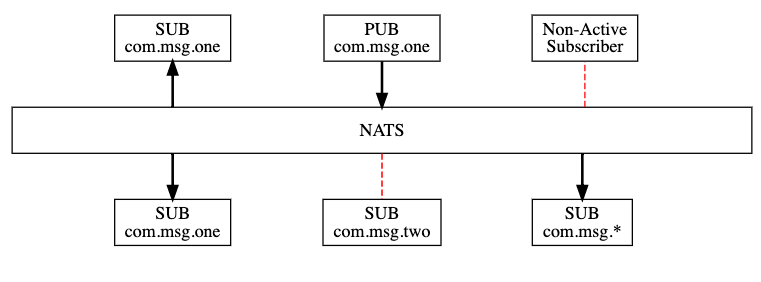

# Subject-Based Messaging 以及 Publish-Subscribe

## Subject-Based Messaging 

- NATS非常依赖于subjects，subjects分为streams和topics
- 可以把subject想象成一个字符串，publisher负责创建subject，subscriber通过subject找到publisher



- subject name不允许包含空格，由阿拉伯字母、点号组成
- subject name大小写敏感

### Subject Hierarchies

"."被用于创建一个subject的继承关系,比如下面的subjects逻辑上都与time相关，通过"."将这些subjects组织了起来

```txt
time.us
time.us.east
time.us.east.atlanta
time.eu.east
time.eu.warsaw
```

### Subject Wildcards

- NATS提供了两个通配符:`*`和`>`，这2个通配符可以代替点分隔主题中的一个或多个元素。
- Subscriber可以利用通配符，从一个subject中产生多个其他的通配符(事先双方约定好)，然后监听这些subject，相当于订阅一次，然后一个subject衍生出多个其他的subject
- Publisher通常不需要使用通配符来组织一个subject，一般只需要提供一个不包含通配符的全限定名的subject即可。所以特殊情况下，才需要提供通配符

#### Matching A Single Token

- 第一个通配符是*，通过*可以匹配到一个single token，比如通过`time.*.east`将会匹配到`time.us.east`和`time.eu.east`



#### Matching Multiple Tokens

- 第二个通配符`>`，可以匹配一个或者多个字符。但是只能往后匹配字符串末尾一级或者多级的字符，不能向前匹配，比如`time.us.>`可以往后匹配到`time.us.east`和`time.us.east.atlanna`。相比前者而言，`time.us.*`只能匹配`time.us.east`这样的字符，



#### Monitoring and Wire Taps

- NATS允许通过通配符创建wire tap来做一些security monitoring
- 最简单的方式：基于`>`创建一个subscriber，这样某个app就能接收到所有的message

#### Mix Wildcards

- 通配符`*`和`>`可以组合使用，比如`*.*.east.>`可以匹配到`time.us.east.atlanta`


## Publish-Subscribe

- One-to-Many,一个publisher发送到消息到某个subject上之后，任何订阅该subject的subscriber都将接收到消息
- Subscriber也可以监听wildcard subjects,通过正则方式(nats也支持你这样做)

## Pub/Sub实操

https://docs.nats.io/developing-with-nats/tutorials/pubsub

- NATS是一个纯粹的publish-subscribe的messaging system，基于subjects
- Subscribers基于某个subject监听消息，如果某个消息没有被任何激活的subscriber监听，那么消息就没有可能被接收
- Subscriber可以通过通配符监听一个或者多个不同的subject



### Installation

https://docs.nats.io/nats-server/installation

#### Installation via Docker - 单机版

```sh
# docker pull the nats image
docker pull nats:latest
# docker run the nats image基于之前创建的network
docker run -p 4222:4222 -ti nats:latest

```

- 默认情况下，4222是客户端运行端口
- 8222是HTTP信息管理的端口
- 6222 是clustering routing port
- 通过-p或者-P来覆盖端口信息


#### Installation via Docker - 集群版

```sh
# 创建nats的docker network
docker network create nats
# docker pull the nats image
docker pull nats:latest
# docker run the nats image基于之前创建的network
docker run --name nats --network nats --rm -p 4222:4222 -p 8222:8222 nats:latest
```

### 下载样例

针对于nats，也有其他类型的client，比如java等，在此，以nats.go为例

```sh
# https://github.com/nats-io/nats.go
git clone https://github.com/nats-io/nats.go.git

```

在运行样例之前，**请保证本地环境已配置好$GOPATH,执行样例的时候，需要设置代理，因为样例代码会远程拉取github仓库中的一些jar包**,如果代理没有设置，会报错：`go: github.com/nats-io/nkeys@v0.3.0: Get "https://proxy.golang.org/github.com/nats-io/nkeys/@v/v0.3.0.mod": dial tcp 172.217.160.113:443: i/o timeout`.

### 运行nats server

见前面步骤，通过docker运行nats

### 运行subscriber

- `go run main.go "your-subject"`来监听某个subject
- 可以运行多个subscriber来监听同一个subject上的消息

```sh
cd <your-work-directory>/go-training/nats.go/examples/nats-sub
go run main.go "your-subject-name"

# 比如；
i323691@C02Z23J2LVDR nats-sub % go run main.go first.subject
Listening on [firstsubject]
```

### 运行publisher

- 格式：`go run main.go "your-subject" "your-message"`在某subject上发布消息
- 一个publisher可以发布多个不同类型的subject

通过运行publisher针对于subject publish一条message

```sh
@C02Z23J2LVDR nats.go % cd examples/nats-pub
@C02Z23J2LVDR nats-pub % ll
total 8
-rw-r--r--  1 i323691  staff  2953 May 27 09:56 main.go
@C02Z23J2LVDR nats-pub % go run main.go first.subject "this is the first nats message"
Published [firstsubject] : 'this is the first nats message'
@C02Z23J2LVDR nats-pub % pwd
/Users/xxxxx/work_dir/training/go-training/nats.go/examples/nats-pub


# 同时，接收方控制台会出现如下变化：
@C02Z23J2LVDR nats-sub % go run main.go first.subject
Listening on [firstsubject]
[#1] Received on [firstsubject]: 'this is the first nats message'
    
```

通过上面，可以得到一个最简单的publish-subscribe message的场景
