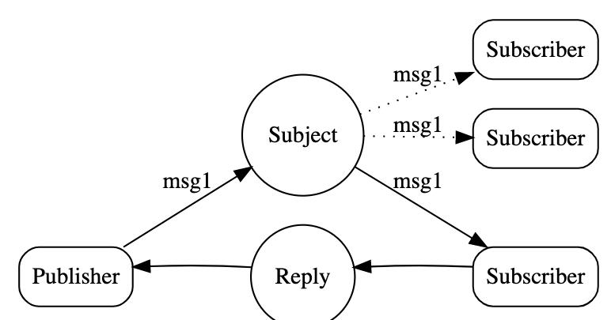

# Request and Reply

https://docs.nats.io/nats-concepts/reqreply

- 在分布式系统中对于request-reply的需求很明确很频繁
- 应用A向应用B发送请求，A要么选择等待响应，要么选择异步方式接受响应
- 当前系统复杂度越来越高，体现在location trasparency, scale up/down, observability, etc

## Location Transparency

比较通俗的解释：`当系统用户想要请求一个资源的时候，用户无需知晓或者提供任何额外的信息，比如提供该资源的系统位于哪里，地址多少，端口多少等等。用户只需要提供想要获取的资源名称，剩下的交给对应的其他服务或者网络组件，去查找并获得资源然后交给用户。这样提供资源的系统/服务对于用户来说是透明的。也就是location transparency。`

```txt
Location transparency is a key characteristic of service-oriented architecture. Consumers of a service do not know a service's location until they locate it in the registry. The lookup and dynamic binding to a service at runtime allows the service implementation to move from location to location without the client's knowledge. The ability to move services improves service availability and performance. By employing a load balancer that forwards requests to multiple service instances without the service client's knowledge, we can achieve greater availability and performance.

As mentioned earlier, a central design principle in object-oriented systems is separation of implementation from interface. This means that an object's interface and its implementation may vary independently. The primary motivation for this principle is to control dependencies between objects by enforcing the interface contract as their only means of interaction.

Service-oriented architecture takes this principle one step further, by reducing the consumer's dependency on the contract itself. This reduced dependency through the use of dynamic binding also has the effect of making the service's location irrelevant. Because the service consumer has no direct dependency on the service contract, the contract's implementation can move from location to location.

A service environment achieves location transparency, because the location is stored in a registry. A client finds and binds to a service and does not care where the service is located. Therefore, an organization has the flexibility to move services to different machines or to move a service to an external provider.

It is also possible to move code from one platform to another. Service-oriented architecture requires that the service support the published contract. The way the service is implemented is irrelevant. Therefore, if it becomes necessary to move a service from a J2EE platform to a .NET platform, no changes to the clients should be necessary.

“Wrap and replace” is a powerful pattern in a service-oriented environment. It gives an organization the flexibility to service-enable current legacy systems without losing the ability to sunset the systems later. A service-enabled legacy system can be replaced with a new component or system without requiring changes to the clients who use the service.
```

总结分析：

- 提供资源的服务/系统，客户端无需知晓，提供资源的服务/系统迁移，客户端无感知也无需感知资源具体位置，客户端不再直接强依赖某个提供资源的服务系统，或者说这种对于资源的依赖性被减弱了
- 通过部署负载均衡，由负载均衡代理资源请求，用户只需知晓负载均衡地址，即可获取资源。这一点和上述特性保障了服务的稳定性和高可用性
- 面向服务的架构:Service-oriented architecture，设计模式：Wrap and replace

## NATS Pattern

- 首先明确一点，和message相关的publisher-subscribe是两码事，是NATS完全独立于消息的另外一个特性，原理类似，但不是同一个东西
- 最明显的区别：在publish-subscribe模式中，subscriber只能接收消息，不能与publisher互动，而在request-reply模式中，双方都可以互相发送消息
- NATS支持Wrap and replace这种包装模式
- 每次在NATS中，publisher通过一个既定义的subject `A` publish 一个`request`，发出的同时附带一个`reply subject B`，subscriber监听subject A接收到消息之后，可以通过Reply subject B发送响应. 在真实实操中，只会出现一个subject，可以把reply subject想象成隐性的
- Publisher被称为requestor，subscriber被称为responders。reply方类似于subscriber，时刻监听某个subject, 而request类似于publisher
- Reply subject全局唯一，被称为inbox
- NATS允许多个响应者运行并形成动态队列组，以实现透明扩展
- NATS应用程序能够在退出之前耗尽资源，从而可以缩小规模而不会丢弃任何请求
- 因为NATS是基于publish-subscribe的消息模式，所以如果要做observability就非常简单，只要向nats发送/接收请求即可嗅探出是否有延迟，是否有anomalies
- NATS



## 实操部分

### 启动nats server

不再赘述，参照之前章节，测试的话，可以以启动docker镜像方式来运行nats server

### 启动reply方

```sh
# 先启动reply方，监听某个subject
@C02Z23J2LVDR nats-rply % pwd
/Users/xxx/work_dir/training/go-training/nats.go/examples/nats-rply

@C02Z23J2LVDR nats-rply % go run main.go first.subject "i can help with something"
Listening on [first.subject]
```

### 启动request方

```sh
# 启动request方，基于某个subject,同时publish消息
@C02Z23J2LVDR examples % cd nats-req
@C02Z23J2LVDR nats-req % go run main.go first.subject "i need help"

Published [first.subject] : 'i need help'
# 立刻收到reply的反馈
Received  [_INBOX.CQifSPlIINZesPPofabtLu.Cu4dBSHR] : 'i can help with something'

# 同时reply方：
@C02Z23J2LVDR nats-rply % go run main.go first.subject "i can help with something"
Listening on [first.subject]
[#1] Received on [first.subject]: 'i need help'
     
```
