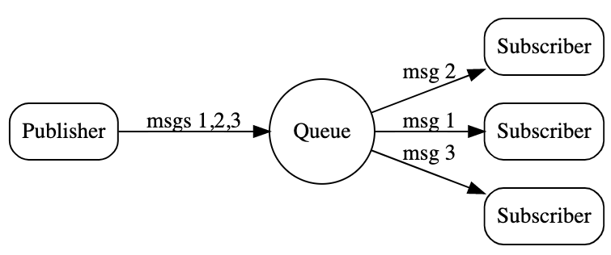

# Queue Groups

https://docs.nats.io/nats-concepts/queue

- 牵涉到应用级别了，在使用层面上
- NATS提供了一个内嵌式的负载均衡-分布式队列(distributed queuees)
- 通过分布式队列，可以为一组subscribers均衡的负载消息传递，通过这种队列可以让应用容错率更高，更好的扩容等等
- 通过传递一个queue name来注册订阅一个queue，所有拥有相同queue name的subscribers会被分配到同一个queue group，除此之外无需其他配置
- 一旦某个消息被publish到某个subject上，NATS会从group中的所有subscriber中随机抽取一个来接收消息。同时该消息有且只会被一个subscriber消费
- queue group名称命名规则以及通配符等，与subject相同，大小写敏感，不能包含空格
- 还有与其他消息中间件不同的是：queue group不是由nats server配置决定，而是由application和application的queue subscribers创建
- queue subscribers非常方便扩容



## 实操

- 默认已下载并准备好nats.go仓库
- 将会下载nats的nodejs样例
- 将会下载nats的ruby样例
- 通过nodejs样例订阅queue subscriber,同时创建一个queue group
- 通过ruby样例订阅queue subscriber,同时创建一个queue group

### 下载nats.js样例

```sh
git clone https://github.com/nats-io/nats.js.git
```

### 下载nats.rb样例

```sh
git clone https://github.com/nats-io/nats.rb.git
```

### 运行nats go client subscriber

- `go run nats-qsub/main.go <your-subscriber> <queue-group-name>`
- 注意此时，nats-qsub是go的客户端，也就是说是在客户端创建subscriber和queue group，而不是运行nats的Docker server

```sh
# 创建一个queue subscriber，同时传入一个queue group name
@C02Z23J2LVDR nats-qsub % pwd
/Users/xx/work_dir/training/go-training/nats.go/examples/nats-qsub
@C02Z23J2LVDR nats-qsub % go run main.go first.subscriber first.queue
Listening on [first.subscriber], queue group [first.queue]
```

### 安装运行nats的nodejs客户端并指定queue group

- `node node-sub --queue=<your-queue-group-name> <your-queue-subscriber-name>`

```sh
# 注意：不要在nats.js目录下执行npm install nats
npm install nats


```

### 安装nats ruby client并指定queue subscriber和queue group

```sh
# 确保你已下载ruby客户端包含examples目录
# 在安装之前确定ruby已经被添加到path上
# export RUBYPATH=/Users/xxxx/.gem/ruby/2.6.0/
# export PATH=$PATH:$RUBYPATH/bin

gem install nats --user-install

@C02Z23J2LVDR nats.rb % gem install nats --user-install
WARNING:  You don't have /Users/xxx/.gem/ruby/2.6.0/bin in your PATH,
          gem executables will not run.
Successfully installed nats-0.11.0
Parsing documentation for nats-0.11.0
Done installing documentation for nats after 0 seconds
1 gem installed

@C02Z23J2LVDR nats.rb % nats-queue first.subscriber first.queue &
[1] 9448
@C02Z23J2LVDR nats.rb % Listening on [first.subscriber], queue group [first.queue]
   

```

### 运行另外一个nats go client不带queue group

```sh

/Users/xxx/work_dir/training/go-training/nats.go/examples/nats-sub
xxx@C02Z23J2LVDR nats-sub % go run main.go first.subscriber
Listening on [first.subscriber]
```

### 通过nats go client publish一条message

```sh
@C02Z23J2LVDR nats-pub % go run main.go first.subscriber "first-message"
Published [first.subscriber] : 'first-message'
@C02Z23J2LVDR nats-pub %   
```

### 实验结果

- queue subscriber其实就是subject
- 上述验证不同nats客户端都具备类似能力，接收消息
- 订制queue subsriber和queue group的能力反转到了客户端
- 如果一个queue group有多个subscriber，那么有且只有一个subscriber能接收到publisher发送的消息
