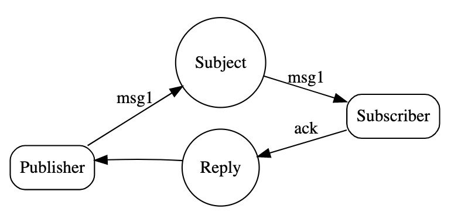

# Acknowledgements and Sequence Numbers

- 适用于request-reply类型消息投递
- 如果系统设计at-most-once，也就是说任何消息只消费一次就丢弃，这样情形下消息可能会被丢失
- 如果应用采用request-reply模式，那么需要设置timeouts来处理任何网络或者因其他系统出错导致的超时
- NATS官网建议通过设定timeout参数(当你使用request-reply模式的时候)，同时在代码中处理timeout，一旦timeout时间到了只会，做相应处理
- 当系统对消息投递要求非常高，那么NATS建议使用Acknowledgement类型的消息(还是request-reply，只是打上标记ACKs)
- ACKs也允许是一个空的message，不带有任何payload
- 因为ack为空，所以不会影响带宽

## 设置timeout

[设置NATS timeout](https://docs.nats.io/developing-with-nats/connecting/connect_timeout)

## Sequence Number

- 实现方式：`updates.1`,`updates.2`，其中1，2分别是sequence number，也可以是token，主要是通过将sequence number包含在subject上
- 通常情况下，one-to-many类型的消息投递，因为网络问题导致消息容易丢失，解决这类问题的办法：消息体中附带上sequence id
- 接受者可以查看sequence id来查看是否丢失东西
- 通过组合使用sequence number和heartbeats，不带任何数据，可以监控是否有丢失的情况
- 如果不通过seq,系统也可以通过持久化消息并检查，也能达到类似效果，但是有时候这样会导致系统过载，造成一定的额外负担

### 最佳实践

- 每个sender必须使用自己的sequence number
- 尽可能让接受者有能力通过sequence id获取到丢失的消息
- `updates.*`，同时subscriber监听subject，获取到*位的字符串，转换成sequence number
- 当没法传递payload或者比较麻烦的情况下，可以将内容放置在subject上
