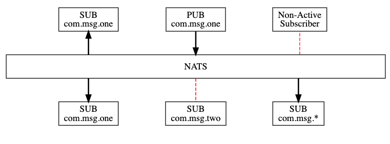

# Pub/Sub

https://docs.nats.io/developing-with-nats/tutorials/pubsub

- NATS是一个纯粹的publish-subscribe的messaging system，基于subjects
- Subscribers基于某个subject监听消息，如果某个消息没有被任何激活的subscriber监听，那么消息就没有可能被接收
- Subscriber可以通过通配符监听一个或者多个不同的subject



## Installation

### Installation via Docker - 单机版

```sh
# docker pull the nats image
docker pull nats:latest
# docker run the nats image基于之前创建的network
docker run -p 4222:4222 -ti nats:latest

```

- 默认情况下，4222是客户端运行端口
- 8222是HTTP信息管理的端口
- 6222 是clustering routing port
- 通过-p或者-P来覆盖端口信息


### Installation via Docker - 集群版

```sh
# 创建nats的docker network
docker network create nats
# docker pull the nats image
docker pull nats:latest
# docker run the nats image基于之前创建的network
docker run --name nats --network nats --rm -p 4222:4222 -p 8222:8222 nats:latest
```
