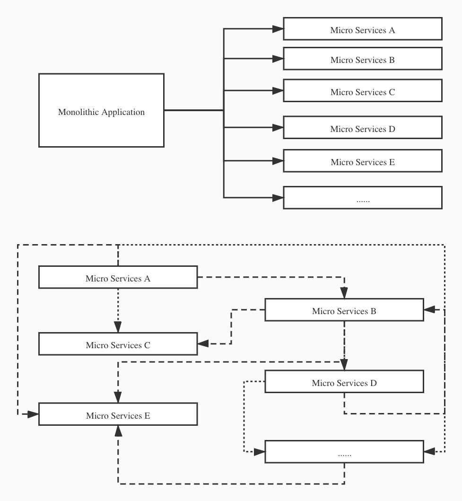
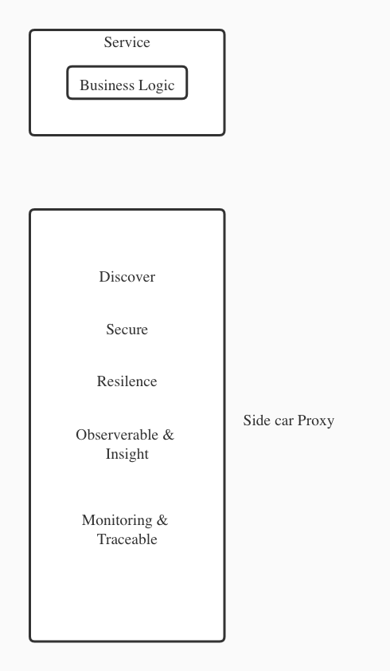
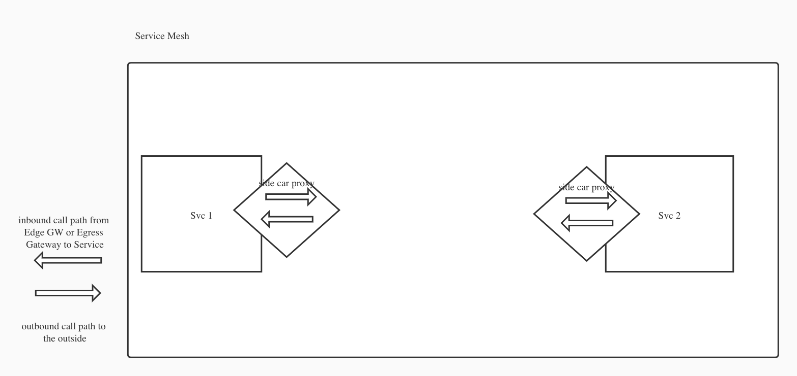

# Service Mesh

## Monolithic to Micro Services

- 老的系统分拆成多个微型服务
- 微型服务之间必然存在相互调用的问题
- 当微型服务之间互相调用关系越复杂，整个微服务系统架构就越复杂

为了保证拆分之后的每个service都可用，于是需要有更多的技术保障各个micro service

为了应用这些技术，就必然会侵入原本的业务代码，造成业务代码和这些非业务代码之间的集成。同时需要引入很多工具和技术，为了做对应的保障。在这种情况下，Service Mesh技术应运而生。

## Service Mesh

- 主要是为了解决上面保障性功能对业务代码的侵入和紧耦合
- 主要是除去业务代码以外的所有task，从微服务中卸下offloads，让微服务自身专注于业务
- side car proxy pattern
- 运用了service mesh之后，每个微服务又有了monolithic app的优点
- Service Mesh负责所有保障性的task和功能

